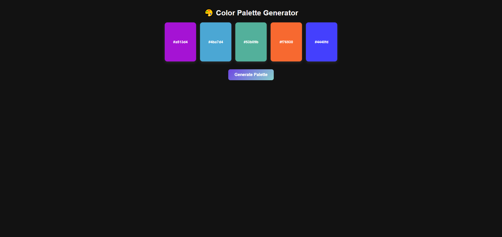
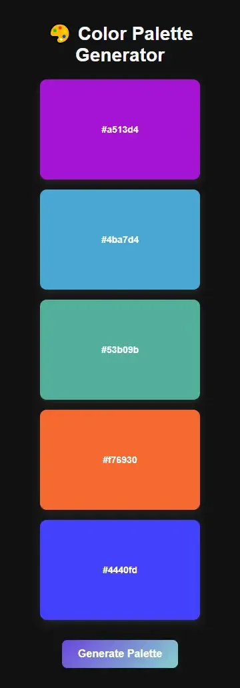

 

### **📜 README.md**

# 🎨 Color Palette Generator

A sleek, **dark mode** color palette generator that creates **random color schemes** with just one click. Easily **copy** color codes by clicking on them, and enjoy a **modern, responsive** design.  

🚀 **Live Demo:** [Coming Soon]

---

## ✨ Features

✅ **Random Color Generation** – Get five unique colors with every click  
✅ **Click-to-Copy** – Copy color hex codes instantly  
✅ **Dark Mode UI** – Aesthetic and modern design  
✅ **Responsive** – Works perfectly on **mobile & desktop**  
✅ **Smooth Animations** – Hover effects and tooltip notifications  

---

## 📌 How to Use

1. **Open the app** in a browser  
2. Click **"Generate Palette"** to create a random color scheme  
3. **Click on a color** to copy its hex code to your clipboard  

---

## 🛠️ Setup & Installation

1. **Clone the repository**  
   ```sh
   git clone https://github.com/kev-n-dev/color-palette-generator.git
   cd color-palette-generator
   ``` 

2. **Open `index.html` in a browser**  

That's it! No dependencies required.  

---

## 📸 Screenshot

  
  

---

## 📝 License

This project is open-source and available under the **MIT License**.

---

### ⭐ Enjoyed this project?  
Give it a **star** ⭐ on GitHub and feel free to **fork** it!  

---

### **What This README Includes**  
✅ **Catchy description**  
✅ **Features list**  
✅ **How to use it**  
✅ **Setup & installation guide**  
✅ **Placeholder for screenshots**  
✅ **License info**  

🔥 This will make your repo **look professional** on GitHub! Let me know if you want any tweaks. 🚀